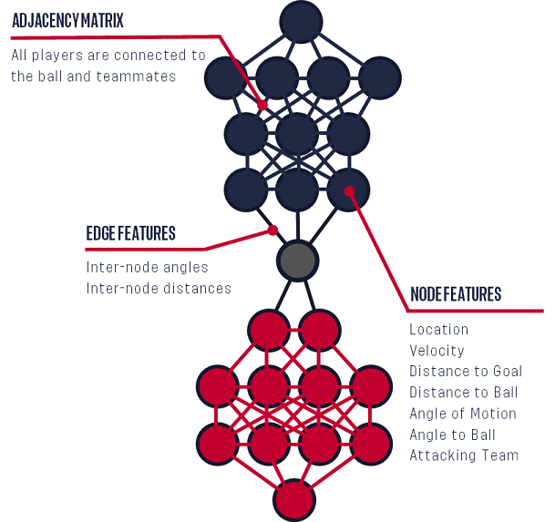

# CounterEval: GNN-Based Predictive Modeling and Performance Evaluation for Soccer Counterattacks Using Tracking Data

<div style="text-align: center;">
    
    <p style="text-align: center;"><em>Image: Generated by Comfyroll with promot Counterattack and Soccer</em></p>
</div>

## Description

Counterattacking is an effective strategy for scoring in modern football, championed by renowned coaches like José Mourinho, Diego Simeone, and Carlo Ancelotti. A successful counterattack is often executed by key players, making it valuable to develop metrics that evaluate individual contributions to the play. Given the complexities of real-time tracking data, we propose a GNN-based approach to assess players’ contributions in counterattacks, which we call **CounterEval**.

## Reproduce our work

### Virtual Environment

```
conda create -f environment.yml
conda activate sds625_soccer
```

### Run All Results

You can get all results of this project by running one of the two following commands.

```
Rscript scripts/Main.R # Option 1
# bash scripts/Main.sh # Option 2
```

### Data

#### Raw Datasets

The source of the raw dataset is [ussf_ssac_23_soccer_gnn](https://github.com/USSoccerFederation/ussf_ssac_23_soccer_gnn). They represent each frame of tracking data as a heterogeneous graph, where nodes correspond to individual players (offensive and defensive) and edges represent the spatial and temporal relationships between players.

* Edge Features:
  * Player Distance - Distance between two players connected to each other
  * Speed Difference - Speed difference between two players connected to each other
  * Positional Sine angle - Sine of the angle created between two players in the edge
  * Positional Cosine angle - Cosine of the angle created between two players in the edge
  * Velocity Sine angle - Sine of the angle created between the velocity vectors of two players in the edge
  * Velocity Cosine angle - Coine of the angle created between the velocity vectors of two players in the edge
  
* Node Features:
  * x coordinate - x coordinate on the 2D pitch for the player / ball
  * y coordinate - y coordinate on the 2D pitch for the player / ball
  * vx - Velocity vector's x coordinate
  * vy - Velocity vector's y coordinate
  * Velocity - magnitude of the velocity
  *  Velocity Angle - angle made by the velocity vector
  * Distance to Goal - distance of the player from the goal post
  * Angle with Goal - angle made by the player with the goal
  * Distance to Ball - distance from the ball (always 0 for the ball)
  * Angle with Ball - angle made with the ball (always 0 for the ball)
  * Attacking Team Flag - 1 if the team is attacking, 0 if not and for the ball
  * Potential Receiver - 1 if player is a potential receiver, 0 otherwise

The Graph configuration is depicted by the graph below:



(source: [ussf_ssac_23_soccer_gnn](https://github.com/USSoccerFederation/ussf_ssac_23_soccer_gnn))

However, the data quality of this dataset is very low. Most other soccer tracking data is not free in the market and we advocate for more open access to high-quality soccer tracking data to facilitate research and development in this field.

To download all raw datasets for our project, run the following command.

```
bash scripts/get_raw_dataset.sh
```

#### Data Cleaning

### Visualization

We also provide a streamlit app to visualize the counterattack process to facilitate our EDA. 

```
streamlit run scripts/visualize_helper.py
```
### Methodology

The **CounterEval** framework introduces a novel approach for evaluating player performance during soccer counterattacks using Graph Neural Networks (GNNs). We leverage high-resolution tracking data and formulate the problem as a predictive modeling task where player movements and their impact on the counterattack outcome are assessed. The methodology is structured as follows:

#### 1. Player Movement Prediction with Graph Neural Networks

To model the dynamic behavior of players, we employ two distinct GNN-based predictive models:

- **Offensive Player Prediction Model**
- **Defensive Player Prediction Model**

These models utilize a **Graph Attention Network (GAT)** architecture, which assigns varying levels of importance to different nodes (players) in the graph based on their interactions and context. By applying attention mechanisms, the GNN learns to focus on key players who are most influential in the counterattack scenario.

**Features Used:**  
The input features for this model include both node-level (e.g., player positions, velocities, angles) and edge-level features (e.g., player distances, velocity differences), capturing the holistic dynamics of the play.

**Training Objective:**  
The models are trained to predict the next-frame position of each player using Mean Squared Error (MSE) as the loss function. This approach minimizes the prediction error, allowing the model to capture typical movement patterns of offensive and defensive players during counterattacks.

**Interpretation of Predictions:**  
The predicted positions serve as a proxy for understanding expected player movements, providing a benchmark for evaluating individual player decisions and actions.

#### 3. Counterattack Outcome Prediction

In addition to player movement prediction, we develop a separate GNN-based model (GAT/GCN) to predict the overall success of a counterattack. 

**Training Objective:**  
This model takes as input the graph representation of the current game state and outputs the probability of a successful counterattack. The model is trained using a **Binary Cross-Entropy (BCE)** loss function, which penalizes incorrect predictions of success or failure.

**Features Used:**  
The input features for this model include both node-level (e.g., player positions, velocities, angles) and edge-level features (e.g., player distances, velocity differences), capturing the holistic dynamics of the play.

#### 4. CounterEval Contribution Score

A key innovation of the CounterEval framework is the introduction of the **CounterEval Contribution Score**, designed to quantify the impact of each player’s actions on the probability of counterattack success. The score is computed as follows:

1. **Baseline Prediction:**  
   Use the movement prediction model to estimate the next-frame positions of all players.

2. **Counterfactual Analysis:**  
   Replace the actual position of a given player with the model’s predicted position, keeping other players’ positions unchanged.

3. **Score Calculation:**  
   Evaluate the change in the predicted probability of a successful counterattack:
   - A **positive score** indicates that the player’s actual movement increased the likelihood of success.
   - A **negative score** suggests that the player’s movement was suboptimal, reducing the probability of a successful counterattack.

This counterfactual approach allows us to isolate and measure the individual contributions of players, providing valuable insights for performance analysis and coaching.

#### 5. Model Training and Evaluation Pipeline

The model training process involves a rigorous pipeline to ensure robust and reliable predictions:

- **Data Splitting:** The dataset is split into training, validation, and test sets based on different games (TODO). 
- **Hyperparameter Tuning:** We perform grid search and Bayesian optimization to fine-tune model hyperparameters, such as the number of GNN layers, hidden dimensions, and attention heads.
- **Evaluation Metrics:** The models are evaluated using standard metrics:
  - For movement prediction models: **Mean Squared Error (MSE)** and **Root Mean Squared Error (RMSE)**.
  - For counterattack outcome prediction: **Accuracy**, **F1-Score**, and **Area Under the ROC Curve (AUC)**.

## Acknowledgement 

## References
1. Sahasrabudhe, A., & Bekkers, J. (2023). _A Graph Neural Network Deep-Dive into Successful Counterattacks_. In 17th Annual MIT Sloan Sports Analytics Conference.
2. Veličković, P., Cucurull, G., Casanova, A., Romero, A., Liò, P., & Bengio, Y. (2017). Graph Attention Networks. arXiv, 1710.10903. Retrieved from https://arxiv.org/abs/1710.10903v3


